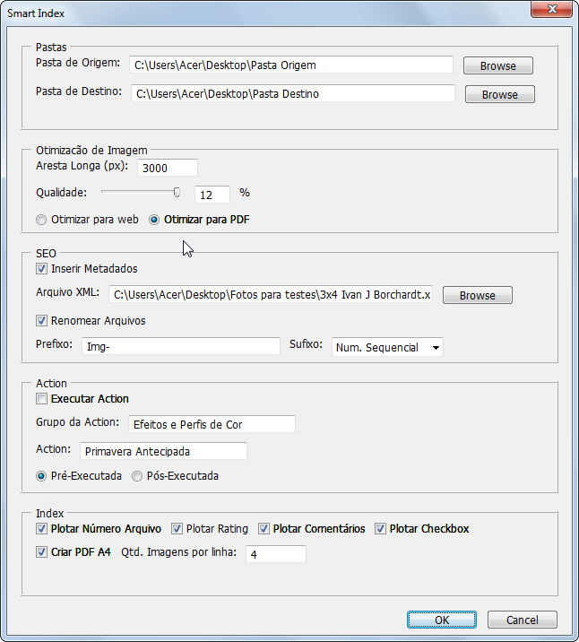

[English](./README.md) | [Português](./README-pt_BR.md) | German

---

# Smart Index

Smart Index ist ein Skript, das für die Ausführung in Photoshop entwickelt wurde. Es ist ein Tool, das für professionelle Fotografen entwickelt wurde, um die Erstellung von Fotoindizes zu automatisieren.
 
Eine der traditionellsten Arten, die Ergebnisse einer fotografischen Arbeit zu präsentieren, sind fotografische Indizes, bei denen kleine fotografische Proofs nebeneinander auf Fotopapierblättern angeordnet werden, die normalerweise im Format A4 angeordnet sind.

In den gängigsten Formen listen die fotografischen Indezes nur die Bilder und ihre jeweiligen Identifikationsnummern auf. Der Vorschlag das Smart Index besteht darin, die Indizes mit einigen zusätzlichen Informationen zu bereichern, die zuvor vom Fotografen festgelegt wurden, um die Auswahl des Kunden zu steuern und genauer zu treffen.

 

## Projekt-Status
### Funktionen

 - [x] Bildoptimierung für WEB- und PDF-Dateien mit Auflösungsauswahl und JPG-Komprimierungsgrad
 - [x] SEO-Aktionen: Aufnahme von Metadaten aus der XML-Datei und Funktion "Datei umbenennen" 
 - [x] Aktion ausführen: Ermöglicht das Ausführen einer benutzerdefinierten Aktion vor oder nach der Bildoptimierung
 - [x] Index erstellen: Enthält Optionen zum Zeichnen von Dateinummer, Bewertung, Kommentaren, Kontrollkästchen und Generieren von PDF in A4
 - [ ] Hinzufügen von Kopf- und Fußzeilendaten (Logo, Datum, Seitenzahl, Studio-Kontaktdaten usw.)
 - [ ] Mehrsprachige Unterstützung hinzufügen
 - [ ] Hinzufügen von Georeferenzierungen zu Fotos (Spot-Datei, Fototrack und eigene mobile App)
 - [ ] Meldung am Ende des Skripts, die angibt, dass die Verarbeitung abgeschlossen ist

## Voraussetzungen
- **Photoshop - Version CS2 oder höher**  

- **Installieren des Smart Index-Ordners**
1. Klonen Sie das Repository 
    
    $ git clone <https://github.com/Ivan-J-Borchardt/SmartIndex>

2. Erstellen Sie das Verzeichnis "~/Documents/Smart Index"
3. Kopieren Sie den gesamten Inhalt des geklonten Repositorys in das im vorherigen Schritt erstellte Verzeichnis. 

- **Installieren des Aktionssatzes**

1. Öffnen Sie das Photoshop
2. Aktivieren Sie die Actions tab
 
   Photoshop>Window>Actions

3. Wählen Sie auf der Actions tab die Option  "Load Action" aus
4. Navigieren Sie zum Projektordner und wählen Sie das Aktionsset "Smart Index Action Set.ant" aus.

## Ausführen der Anwendung

1. Öffnen Sie das Photoshop
2. Führen Sie das Skript "Smart Index" aus

    Photoshop>File>Scripts>Browse, 
     und wählen Sie den Pfad zum Skript. 

3. Konfigurieren Sie den Smart Index nach Ihren Wünschen und klicken Sie auf "OK".

### Technologie 

- Photoshop
- JavaScript

### Autor
Ivan J. Borchardt

 

### Lizenz
Dieses Projekt steht unter der MIT-Lizenz.
