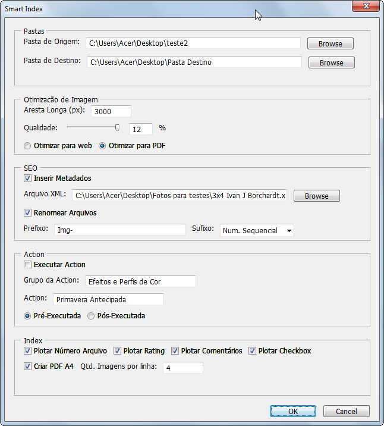

English | [Português](./README-pt_BR.md) | [German](./README-de_DE.md)

---

# Smart Index

Smart Index is a Script developed to run within Photoshop, it is a tool developed for professional photographers to automate the creation of photographic indexes.
 
 One of the most traditional ways of presenting the results of a photographic work is through photographic indexes, which consist of assembling small photographic proofs arranged side by side on sheets of photo paper, usually in A4 size.

In the most common forms, the photographic indexes only list the images and their respective identification numbers. The Smart Index proposal is to enrich the indexes with some additional information, previously set by the photographer in order to direct and make the customer's choice more accurate. 

 

## Project Status
### Functionalities

 - [x] Image optimization for WEB and PDF Files with resolution selector and JPG compression degree
 - [x] SEO actions: inclusion of metadata from XML file and Rename File function 
 - [x] Execute Action: Allows you to execute a Custom Action before or after image optimization
 - [x] Create Index: includes options to plot File number, Rating, Comments, Check Box and generate PDF in A4 
 - [ ] Add header and footer data (Logo, Date, Page number, Studio contact details, etc.)
 - [ ] Add Multi-Language Support
 - [ ] Add Geo-Referencing to photos (Spot file, Photo Track and own mobile app) 
 - [ ] Message on the end of the Script announcing that the processing is finished

## Prerequisites
- **Photoshop - Version CS2 or higher**  

- **Installing the Smart Index folder**
1. Clone the repository 
    
    $ git clone <https://github.com/Ivan-J-Borchardt/SmartIndex>

2. Create the directory "~/Documents/Smart Index"
3. Copy all the contents of the cloned repository to the directory created in the previous step. 

- **Installing the Action Set**

1. Open the Photoshop
2. Enable the Actions tab
 
   Photoshop>Window>Actions

3. In the Actions tab options select "Load Action"
4. Navigate to the project folder and select the Action Set "Smart Index Action Set.ant"

## Running the Application

1. Open the Photoshop
2. Run the "Smart Index" Script

    Photoshop>File>Scripts>Browse, 
     and select the path to the Script. 

3. Configure the Smart Index according to your preferences and click "OK"

### Technology

- Photoshop
- JavaScript

### Author
Ivan J. Borchardt

 

### License
This project is under the MIT license.
